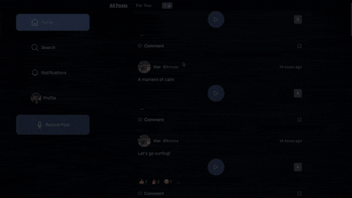

# Goss

<p align="center">
  
</p>

Goss is a social media platform where users share voice notes instead of written posts. Think of it as Twitter, but for audio content! Users can record, post, listen to, and interact with voice notes, making it a unique way to connect through sound.

- Voice note posts: Users can record and post voice messages instead of written text.
- Feed: Listen to the latest voice notes from the people you follow.
- Reactions & Comments: Engage with voice notes by reacting or commenting via voice.
- Real-time chat: New voice notes appear in real-time as they’re posted.
- User Profiles: Each user has a profile showcasing their posted voice notes.
- Following & Followers: Follow users to keep up with their latest voice notes.
- AI voice generation: Use the text-to-speech AI voices to post
- Voice notes transcriptions: Let everyone know what you think with audio-to-text transcription

### Demo

<p align="center">
  
</p>

### Getting Started

1. Clone the repo 
```sh
git clone https://github.com/salmon-01/gossip.git
```
2. Install dependencies
```
cd goss
npm install
```
3. Create ```.env.local``` file in goss directory:
```sh
NEXT_PUBLIC_SUPABASE_URL=your-supabase-url
NEXT_PUBLIC_SUPABASE_ANON_KEY=your-supabase-anon-key
OPENAI_API_KEY=your-openai-platform-key
PLAY_HT_API_KEY=your-play-ht-key
PLAY_HT_USER_ID=your-play-ht-user-id
```

4. Run the project:
```sh
npm run dev
```

## Tech Stack

- NextJS
- Typescript
- React
- WaveSurferJS
- Supabase
- PlayHT API
- Whisper 1 by OpenAI
- Vitest
- TailwindCSS
- Shadcn/ui

## Authors
- Joshua Tuddenham - [GitHub](https://github.com/joshuaisaact) - [LinkedIn](https://www.linkedin.com/in/joshuatuddenham/)
- Ilya Onoprienko - [GitHub](https://github.com/salmon-01) - [LinkedIn](https://www.linkedin.com/in/ilya-onoprienko/)
- Kieran Mozer - [GitHub](https://github.com/kmoze) - [LinkedIn](https://www.linkedin.com/in/kiermozer/)
- Jamal Onanuga - [GitHub](https://github.com/jamalona) - [LinkedIn](https://www.linkedin.com/in/jamal-onanuga/)
- Frederick Moore - [GitHub](https://github.com/Fred-A-M) - [LinkedIn](https://www.linkedin.com/in/frederic-moore/)